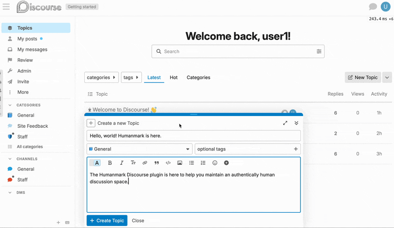

# Discourse Humanmark Plugin

[](https://github.com/humanmark/discourse-humanmark)
[](LICENSE)

**Know what's human in your Discourse forum.** In a world where AI passes every test, Humanmark provides the strongest signal of human intent through hardware-backed verification.

Learn more about Humanmark:

- [For Developers](https://humanmark.dev) / [For Users](https://humanmark.app)
- [iOS App](https://apps.apple.com/app/humanmark/id6749082431) / [Android App](https://play.google.com/store/apps/details?id=com.humanmark.android)

## Why Humanmark?

Traditional verification methods have failed. CAPTCHAs are IQ tests that AI solves better than humans. Behavioral analysis patterns are perfectly mimicked by sophisticated automation. Risk scoring frustrates real users while automation slips through.

**Humanmark is different.** We provide definitive yes/no determinations of human presence using secure device hardware. No puzzles, no behavioral tracking. Just cryptographic certainty.

## User Experience

Want to see what your users will experience? Try the verification flow yourself at [humanmark.dev/demo](https://humanmark.dev/demo). The process takes just seconds using your device's built-in authentication (fingerprint/face recognition or device passcode).



## Beta Program

The Discourse Humanmark plugin is currently in beta. We're looking for select Discourse communities to participate and receive an increased allotment of verifications in the free tier for the duration. See [humanmark.dev/pricing](https://humanmark.dev/pricing) for pricing details.

## Features

✅ **Know What's Human** - Distinguish human intent from automation:

- Verify presence before creating posts
- Protect topic creation from automated abuse
- Secure private message sending
- Support for anonymous users and Discourse's anonymous mode

✅ **Smart Bypass Rules** - Balance security with user experience:

- Skip verification for staff members
- Set trust level thresholds for automatic bypass
- Maintain smooth experience for established community members
- Configure reverification periods to reduce friction for regular users
- Per-context reverification settings (posts/topics/messages)

✅ **Privacy-First**:

- Zero data retention - completely stateless
- No accounts or personal information required
- Instant verification using familiar device authentication
- Works on 95% of modern smartphones

✅ **Seamless Integration**:

- Matches your site's theme (light/dark/auto)
- Non-intrusive flow that respects users
- Works alongside existing Discourse security
- Dynamic enabling/disabling without restart
- Atomic operations and optimistic locking for reliability

## Requirements

- **Discourse 3.0.0** or later (required for Rails 7.0 support)
- Humanmark API credentials (obtain from [humanmark.dev](https://humanmark.dev))

## Installation

1. SSH into your server and navigate to your Discourse directory:

   ```bash
   cd /var/discourse
   ```

2. Open your container's app.yml file:

   ```bash
   nano containers/app.yml
   ```

3. Add the plugin to your container's configuration. Find the `hooks` section and add the git clone command:

   ```yaml
   hooks:
     after_code:
       - exec:
           cd: $home/plugins
           cmd:
             - git clone https://github.com/humanmark/discourse-humanmark
   ```

   Alternatively, if you already have other plugins, add it to the existing list:

   ```yaml
   hooks:
     after_code:
       - exec:
           cd: $home/plugins
           cmd:
             - git clone https://github.com/discourse/docker_manager
             - git clone https://github.com/humanmark/discourse-humanmark
   ```

4. Save the file and rebuild your container:
   ```bash
   ./launcher rebuild app
   ```

The rebuild process will take several minutes. Once complete, the plugin will be available in your Discourse admin panel.

## Configuration

1. **Get your API credentials**:
   - Visit [humanmark.dev](https://humanmark.dev) to learn more
   - Contact sales@humanmark.io for beta access

2. **Configure the plugin**:
   - Navigate to Admin → Settings → Plugins → Humanmark
   - Enter your API credentials and domain
   - Choose which actions require verification
   - Enable the plugin (takes effect immediately, no restart needed)

### Available Settings

**API Configuration**:

- `humanmark_enabled` - Master on/off switch
- `humanmark_api_key` - Your public API key (from Humanmark dashboard)
- `humanmark_api_secret` - Your private API secret (keep secure!)
- `humanmark_domain` - Verification domain (must be allowlisted in your Humanmark account)

**UI Configuration**:

- `humanmark_theme` - Widget appearance (light/dark/auto)

**Protection Settings**:

- `humanmark_protect_posts` - Require verification for post creation
- `humanmark_protect_topics` - Require verification for new topics
- `humanmark_protect_messages` - Require verification for private messages

**Bypass Settings**:

- `humanmark_bypass_staff` - Staff members skip verification
- `humanmark_bypass_trust_level` - Minimum trust level to bypass (0-5, use 5 for no bypass)

**Rate Limiting**:

- `humanmark_max_challenges_per_user_per_minute` - Per-user minute limit (1-20, default: 3)
- `humanmark_max_challenges_per_user_per_hour` - Per-user hourly limit (1-100, default: 15)
- `humanmark_max_challenges_per_ip_per_minute` - Per-IP minute limit (1-50, default: 10)
- `humanmark_max_challenges_per_ip_per_hour` - Per-IP hourly limit (1-500, default: 50)

Logged-in users hit whichever limit comes first (per-user or per-IP). Anonymous users use per-IP limits only.

**Reverification Periods**:

- `humanmark_reverify_period_posts` - Minutes before re-verification needed for posts (0-10080, default: 30)
- `humanmark_reverify_period_topics` - Minutes before re-verification needed for topics (0-10080, default: 0)
- `humanmark_reverify_period_messages` - Minutes before re-verification needed for messages (0-10080, default: 60)

Set to 0 to always require verification, or up to 10080 (7 days) to remember verification. Retention period automatically extends to accommodate the longest reverify period.

**Data Retention**:

- `humanmark_flow_retention_days` - Days to keep verification records (1-365, default: 30)

**Debug Settings**:

- `humanmark_debug_mode` - Log sensitive debug information (default: false, see Debugging section for details)

## Troubleshooting

### Verification widget doesn't appear

- Check your API credentials are correct
- Ensure the plugin is enabled
- Verify your domain is allowlisted in your Humanmark account
- Look for JavaScript console errors prefixed with `[Humanmark]`
- Look for errors in Admin → Logs

### Users report verification failures

- Verify your API secret matches your API key
- Check if challenges are expiring (1 hour timeout)
- Ensure your server clock is synchronized

### Users hit rate limits

See Rate Limiting settings above for limits and defaults. Users see a countdown timer when rate limited. Consider increasing per-IP limits for shared networks (offices, schools).

### Anonymous users

- Anonymous users (not logged in) require verification if your site allows anonymous posting
- Anonymous users must verify each time (reverification periods don't apply)
- Discourse's anonymous mode (logged-in users posting anonymously) works normally with verification
- Rate limits apply per IP for anonymous users, which may affect shared networks

### Performance

- Verification completes in seconds using device authentication
- Receipts validated locally with cryptographic signatures (no API roundtrip)
- Only users below trust threshold require verification

## Debugging & Monitoring

### Logging Levels

The plugin uses two levels of debug logging:

1. **Standard Debug Logs** - Controlled by Rails log level
   - Operational information (API success, validation confirmations)
   - Performance metrics (request duration, timeouts)
   - Non-sensitive debugging information
   - Enable by setting Rails log level to `debug` in your Discourse configuration

2. **Sensitive Debug Logs** - Controlled by `humanmark_debug_mode` setting
   - Challenge IDs and tokens (even truncated)
   - User-specific verification details
   - Full API URLs with parameters
   - Error stack traces with system paths
   - JWT validation details

### Debug Mode

When `humanmark_debug_mode` is enabled, sensitive information is logged including challenge IDs, tokens, API URLs, and JWT details. Only enable when actively troubleshooting. View logs in **Admin → Logs** (`/admin/logs`).

### Viewing Logs

All Humanmark logs are prefixed with `[Humanmark]` for easy filtering:

1. Go to **Admin → Logs** (`/admin/logs`)
2. Search for `[Humanmark]` to filter plugin-specific logs
3. Log levels indicate severity:
   - **Debug**: Detailed operational flow (requires debug log level or debug mode)
   - **Info**: Important business events (flow lifecycle, bypass reasons)
   - **Warning**: Issues that don't prevent operation (rate limits, validation failures)
   - **Error**: Critical issues (API failures, authentication errors)

### Events

The plugin emits DiscourseEvent triggers for monitoring:

- `humanmark_flow_created` - New verification flow started
- `humanmark_flow_completed` - Flow completed successfully
- `humanmark_flow_expired` - Flow expired before completion
- `humanmark_verification_completed` - User verification succeeded
- `humanmark_verification_failed` - User verification failed
- `humanmark_verification_bypassed` - Verification skipped (staff, trust level, or recent verification)
- `humanmark_rate_limited` - Rate limit exceeded

All events include structured data with IDs, contexts, and reasons.

### Admin Reports

Monitor verification metrics directly in your Discourse admin panel to understand and optimize your community's verification patterns.

#### Accessing Reports

1. Navigate to **Admin → Reports** (`/admin/reports`)
2. Search for "humanmark" to see all available reports
3. Click any report to view detailed metrics
4. Adjust date ranges using the built-in date selector
5. Export data as needed for further analysis

#### Available Reports

##### 1. Humanmark Activity (`humanmark_activity`)

**Display**: Stacked bar chart - Track daily verification patterns

Metrics shown:

- **Created** (turquoise): New verification flows initiated
- **Completed** (green): Successfully verified users
- **Expired** (magenta): Flows that timed out (1-hour limit)
- **Bypassed** (purple): Verifications skipped for trusted users

High expiration rates may indicate UX issues. Compare created vs completed to calculate success rates. Monitor bypass patterns to optimize trust level settings. Identify peak verification times for capacity planning.

##### 2. Humanmark by Context (`humanmark_contexts`)

**Display**: Table view - Shows verification breakdown by content type

Columns for each context (Post, Topic, Message):

- **Total**: All verification attempts (created + bypassed)
- **Created**: Verification flows started
- **Completed**: Successfully verified
- **Expired**: Timed out verifications
- **Bypassed**: Skipped due to rules
- **Success %**: Completion rate (completed/created × 100)

Use this report to identify which content types need most protection, compare success rates across contexts, and adjust context-specific settings based on data.

##### 3. Humanmark Bypasses (`humanmark_bypasses`)

**Display**: Table view - Analyze bypass patterns

Bypass reasons tracked:

- **Staff**: Admins and moderators (when `humanmark_bypass_staff` enabled)
- **Trust Level**: Users meeting or exceeding `humanmark_bypass_trust_level`
- **Recent Verification**: Users who verified recently (within reverification period)

High staff bypasses are normal for active moderation teams. Adjust trust level threshold if too many/few bypasses occur. Fine-tune reverification periods based on recent verification counts.

##### 4. Humanmark Rate Limits (`humanmark_rate_limits`)

**Display**: Table view - Monitor rate limiting effectiveness

Rate limit types:

- **Per User Minute**: Individual user per-minute limits
- **Per User Hour**: Individual user hourly limits
- **Per IP Minute**: IP-based per-minute limits (all users)
- **Per IP Hour**: IP-based hourly limits (all users)

High per-IP limits may indicate shared networks (offices/schools). Consistent user limits might suggest automation attempts. Adjust limits based on legitimate usage patterns and consider increasing during high-traffic periods.

#### Understanding the Data

##### Success Rate Calculation

Success Rate = (Completed Flows / Created Flows) × 100

- **Good**: 80-95% (users complete verification smoothly)
- **Concerning**: 60-80% (may need UX improvements)
- **Poor**: Below 60% (investigate integration issues)

##### Notes

- Only actual verification attempts counted (preflight checks excluded)
- Metrics update immediately
- Data retention matches `humanmark_flow_retention_days` setting
- Uses PluginStore with daily aggregation

##### Optimizing Based on Reports

1. **High Expiration Rates**:
   - Ensure SDK loads properly
   - Check for JavaScript errors
   - Verify domain is allowlisted in Humanmark account
   - Consider user education about the verification process

2. **Low Success Rates**:
   - Review API credentials
   - Check network connectivity
   - Verify CSP settings allow SDK
   - Monitor error logs for patterns

3. **Excessive Bypasses**:
   - Review trust level settings
   - Adjust reverification periods
   - Consider context-specific rules

4. **Rate Limit Issues**:
   - Identify legitimate high-usage scenarios
   - Adjust limits for shared networks
   - Monitor for automation abuse patterns

### Key Metrics

- **Completion rate**: Successful vs expired/failed flows
- **Bypass reasons**: Why verifications are skipped
- **Rate limits**: Automation patterns vs legitimate usage
- **API performance**: Response times and timeouts
- **Errors**: API failures and validation issues

## Support

- 📧 Email: support@humanmark.io
- 🐛 Issues: [GitHub Issues](https://github.com/humanmark/discourse-humanmark/issues)

## Architecture

- **Service Objects**: Single-responsibility business logic
- **Flow Model**: Atomic state transitions for verification lifecycle
- **Frontend Integration**: Composer hooks for seamless verification
- **Event System**: Discourse event handlers for content interception

## Contributing

We're currently working on our public contribution process. Stay tuned for guidelines on how to contribute to this project.

## Testing

The plugin includes full test coverage across all components

## License

This plugin is licensed under the GNU General Public License v2.0 or later. See [LICENSE](LICENSE) for details.
